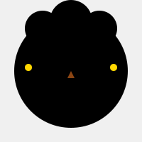
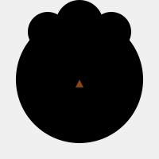

# Papavatar API

A lightweight API that generates unique avatar images based on any text identifier. Each avatar is deterministic, meaning the same identifier always produces the same avatar.

## Quick Start

```bash
npm install
npm run dev
```

The server will start on `http://localhost:3000`

## Endpoints

### Generate Avatar

```
GET /api/avatar/:identifier
```

Returns an SVG avatar image based on the provided identifier.

**Parameters:**

- `identifier` (path) - Any string value (username, email, ID, etc.)
- `size` (query, optional) - Image size in pixels (50-1000, default: 200)

**Example:**

```
GET http://localhost:3000/api/avatar/panquesita?size=200
```

### Get Avatar Info

```
GET /api/avatar/:identifier/info
```

Returns the feature characteristics of an avatar without generating the image.

**Response:**

```json
{
  "identifier": "panquesita",
  "features": {
    "skinColor": "hsl(235, 50%, 70%)",
    "eyeType": 2,
    "mouthType": 1,
    "noseType": 1,
    "hairType": 3,
    "hairColor": "hsl(154, 60%, 50%)",
    "accessoryType": 2
  }
}
```

## Examples

The API generates unique avatars with different combinations of eyes, mouths, noses, hairstyles, and accessories:

<table>
  <tr>
    <td align="center">
      <br />
      <code>panquesita</code>
    </td>
    <td align="center">
      <br />
      <code>jhona</code>
    </td>
    <td align="center">
      <br />
      <code>pepeantonio</code>
    </td>
  </tr>
</table>

## How It Works

The API uses SHA-256 hashing to convert any identifier into a unique set of avatar features. Since hash functions are deterministic, the same input always generates the same avatar, making them perfect for user profiles and consistent visual identities, (note that they are not very pretty yet, but i'll work on that).

## Production Build

```bash
npm run build
npm start
```

## Tech Stack

- Fastify - Fast web framework
- TypeScript - Type safety
- SVG - Scalable vector graphics for crisp avatars at any size
